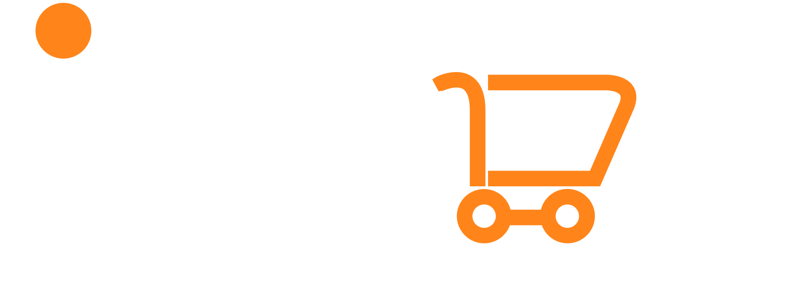

<!-- # React + Vite

This template provides a minimal setup to get React working in Vite with HMR and some ESLint rules.

Currently, two official plugins are available:

- [@vitejs/plugin-react](https://github.com/vitejs/vite-plugin-react/blob/main/packages/plugin-react/README.md) uses [Babel](https://babeljs.io/) for Fast Refresh
- [@vitejs/plugin-react-swc](https://github.com/vitejs/vite-plugin-react-swc) uses [SWC](https://swc.rs/) for Fast Refresh

## Expanding the ESLint configuration

If you are developing a production application, we recommend using TypeScript and enable type-aware lint rules. Check out the [TS template](https://github.com/vitejs/vite/tree/main/packages/create-vite/template-react-ts) to integrate TypeScript and [`typescript-eslint`](https://typescript-eslint.io) in your project. -->

# Welcome to iShop

`iShop` is an e-commerce platform dedicated to bringing you the latest and most high-quality electronic products. We are an online store that sells high-quality electronic products at great prices. From smartphones and laptops to smart Accessories, we have everything you need. Our website is easy to use, secure, and designed to give you a smooth shopping experience.

We focus on quality, good prices, and great customer service to make sure you get the best tech products with ease.

## 📢 iShop Logo



# 🌟 Two Main Features of iShop:

## 🛍️ For Users:

### 🔍 Smart Search & Filtering
- Users can search for products with **auto-suggestions** (e.g., typing "iPhone" suggests "iPhone 14 Pro").
- **Logged-in users** can save and clear search history.
- Advanced **filter options**:
  - **Price Range:** Set a minimum and maximum price to find items within budget.
  - **Brand-Specific Search:** Filter by brands like **Samsung** or **Apple** to find desired products.

### 🛒 Seamless Shopping Experience
- Only **logged-in users** can add items to the cart or make purchases.
- Detailed product pages with **"Add to Cart"** and **"Buy Now"** options.
- **Autosave feature** for logged-in users' carts for a smooth shopping experience.

### 💳 Easy & Secure Payments
- Choose between **store pickup** or **home delivery**.
- Users must **confirm address and phone number** before payment.
- Payments are processed via **Bakong QR code**.
- After successful payment, a **"Payment Successful"** pop-up is displayed.

### 🔑 User Authentication & Account Management
- **Simple Signup**: Register with an **email and password** (optional details: name, phone, address).
- **Forgot Password?** Reset via email easily.
- **Profile Management**: Users can **update their personal information** at any time.

---

## 🔧 For Admins (Admin Dashboard):

### 🛠️ Product Management (CRUD System)
- Secure **admin login** with **email/username and password**.
- Admins can **add, edit, delete, and manage** products efficiently.
- Editable product details include:
  - **Name, Description, Price, Stock, Category, Images, Thumbnails, and Specifications.**
- **Built-in validation** ensures all required fields are filled before saving products.

---

This structure ensures a **smooth shopping experience for users** and **efficient management for admins**! 🚀


## 🚀 Why Choose iShop?

At **iShop**, we are committed to providing the best online shopping experience for electronic products. Here’s why you should choose us:

- ✅ **Money-Back Guarantee:** We prioritize customer satisfaction. If you’re not happy with your purchase, we offer a hassle-free money-back guarantee within 30 days.

- 🚚 **Free and Fast Delivery:** Enjoy **free shipping** on all orders over **$140**. We ensure fast and reliable delivery so you can get your favorite electronics quickly.

- 🔒 **100% Secure Payment:** Shop with confidence! We use **advanced encryption technology** to protect your transactions, ensuring that your payments are **safe and secure**.

- 🎧 **24/7 Customer Service:** Our dedicated **support team** is available **24/7** to assist you with any inquiries, providing a smooth and worry-free shopping experience.

At iShop, we strive to bring you the best electronics with excellent service, secure payments, and reliable delivery. Shop with us today and experience the **future of online shopping!** 🛍️✨


## 🔧 What We Have Done

### 👥 User Management
- 🔑 **Sign Up & Profile Update**
- 🔒 **Login via Email, Password, or Google**

### 🔍 Smart Search & Filtering
- 🔎 **Auto-suggestions** for quick product searches
- 💾 **Save & clear search history** (logged-in users)
- 🔍 **Filter by price range & brand (e.g., Apple, Samsung)**

### 🛒 Seamless Shopping
- 🛍️ **Cart & purchase access for logged-in users**
- 📄 **Product pages with "Add to Cart" & "Buy Now"**
- 🔄 **Autosave for cart items**

### 💳 Secure Payments
- 🚚 **Store pickup or home delivery options**
- ✅ **Confirm address & phone before payment**
- 💰 **Bakong QR code payment**
- 🎉 **"Payment Successful" confirmation**

🚀 **A smooth shopping experience for users & efficient management for admins!**
## Getting Started
To get started, you can simply clone this `iShop` repository and install the dependencies.

### Clone the `iShop` repository using Git:

```sh
git clone https://github.com/Foundation3rdGenScholarship/iShop.git
cd iShop
```
### Install dependencies with this command:
```sh
npm install
```

### Run the application with this command:
```sh
npm run dev
```

## 🔗 Page URLs

- **Login:** [http://localhost:5173/login](http://localhost:5173/login)
- **Register:** [http://localhost:5173/register](http://localhost:5173/register)
- **Home Page:** [http://localhost:5173/](http://localhost:5173/)
- **About Us:** [http://localhost:5173/about](http://localhost:5173/about)

## 🛠 Tech Stack

Our project is built using the following technologies:

### 🌐 Frontend:
- **HTML** -  The standard markup language for structuring web pages.
- **CSS** -  Styles the website for a visually appealing UI.
- **JavaScript** - Adds interactivity and dynamic content to the frontend.
- **Tailwind CSS** - Utility-first CSS framework for styling.
- **React.js** - JavaScript library for building user interfaces.
- **Flowbite** - A component library built on Tailwind CSS for faster development.
- **Redux** - A state management library that helps manage application-wide state in React apps.

### 🖥️ Backend:
- **Node.js** – JavaScript runtime for the backend.
- **PostgreSQL** – A database used to store and manage data.
- **Spring Boot** – A Java-based backend framework for building web applications and APIs.
- **Docker** – A tool used for containerizing applications, often backend services.
- **Spring Data JPA** – A library that simplifies database interactions in Java backend applications.

#### 🗄 Database:
- **PostgreSQL** – A powerful, open-source relational database system known for its reliability, extensibility, and performance.
  - ACID-compliant transactions for data integrity.
  - Supports SQL and JSON for structured and semi-structured data.
  - High scalability and performance with indexing, full-text search, and optimizations.
  - Strong security features including authentication, access control, and encryption.

---

### ⚙️Deployment:
- **Vercel** - Deployment platform for frontend hosting

### 🛠 Tools & Utilities:
- **ESLint & Prettier** - Code linting and formatting
- **Postman** - API testing tool


## 🌐 Access the Local Server
Open your web browser and navigate to [http://localhost:5173/](http://localhost:5173/) to access the GradesBot application running locally.

## 🙏 Acknowledgement
We would like to express our deepest gratitude to our mentors, **Ms. Sin Sreyphea** and **Mr. Sreng Chipor**, for their invaluable guidance, patience, and unwavering support throughout this journey.

Their expertise and mentorship have been instrumental in helping us develop **iShop**, our eCommerce platform for selling electronic products. From conceptualizing the idea to building and refining the website, their insightful advice and encouragement have empowered us to overcome challenges and continuously improve our work.

This project would not have been possible without their dedication and belief in our abilities. We are truly grateful for their mentorship and for inspiring us to grow as developers.

**Thank you for being an essential part of our journey!**

## 😍 Our Slogan
**Smart Teach, Smart Shopping - Only at iShop.**
